# TMGL Portal - Frontend

Portal web desenvolvido para a **The WHO Traditional Medicine Global Library (TMGL)** em parceria com a **BIREME**. Plataforma Next.js que consome conteúdo gerenciado no WordPress.

## 📋 Overview

Este projeto é um portal web moderno e responsivo que serve como biblioteca digital global para medicina tradicional. O frontend consome conteúdo de múltiplas fontes (WordPress CMS, APIs externas) e apresenta informações organizadas por regiões, países, dimensões temáticas e recursos especializados.

### Características Principais

- 🌍 **Multi-regional**: Suporte para diferentes regiões e países
- 🌐 **Multi-idioma**: Sistema de internacionalização (em desenvolvimento)
- 📱 **Responsivo**: Design adaptável para todos os dispositivos
- 🔍 **Busca Avançada**: Sistema de busca e filtros para recursos bibliográficos
- 📊 **Diversos Formatos**: Suporte para PDFs, vídeos, multimídia, RSS feeds
- 🎨 **UI Moderna**: Interface construída com Mantine UI

## 📑 Sumário

- [Tecnologias](#-tecnologias)
  - [Linguagem e Framework](#linguagem-e-framework)
  - [Estilização](#estilização)
- [Bibliotecas Principais](#-bibliotecas-principais)
  - [UI e Componentes](#ui-e-componentes)
  - [Gerenciamento de Estado e Dados](#gerenciamento-de-estado-e-dados)
  - [Processamento de Documentos](#processamento-de-documentos)
  - [Utilitários](#utilitários)
  - [Processamento de Mídia](#processamento-de-mídia)
  - [Integrações Especializadas](#integrações-especializadas)
- [Integrações](#-integrações)
  - [CMS e Conteúdo](#cms-e-conteúdo)
  - [APIs Externas](#apis-externas)
  - [Serviços de Terceiros](#serviços-de-terceiros)
  - [Processamento de Arquivos](#processamento-de-arquivos)
- [Estrutura do Projeto](#-estrutura-do-projeto)
- [Como Executar](#-como-executar)
  - [Pré-requisitos](#pré-requisitos)
  - [Instalação](#instalação)
  - [Variáveis de Ambiente](#variáveis-de-ambiente)
  - [Executar em Desenvolvimento](#executar-em-desenvolvimento)
  - [Build para Produção](#build-para-produção)
  - [Scripts Disponíveis](#scripts-disponíveis)
- [Funcionalidades Principais](#-funcionalidades-principais)
- [Documentação de Componentes](#-documentação-de-componentes)
  - [Layout](#layout-componentslayout)
  - [Breadcrumbs](#breadcrumbs-componentsbreadcrumbs)
  - [Cards](#cards-componentscards)
  - [Categories](#categories-componentscategories)
  - [Embed](#embed-componentsembed)
  - [Forms](#forms-componentsforms)
  - [Feed](#feed-componentsfeed)
  - [Multitab](#multitab-componentsmultitab)
  - [PDF View](#pdf-view-componentspdfview)
  - [Share](#share-componentsshare)
  - [Slider](#slider-componentsslider)
  - [Video](#video-componentsvideo)
  - [Videos](#videos-componentsvideos)
  - [GPT](#gpt-componentsgpt)
  - [RSS](#rss-componentsrss)
  - [Sections](#sections-componentssections)
- [Documentação de Páginas e Rotas](#-documentação-de-páginas-e-rotas)
- [Documentação de Services e APIs](#-documentação-de-services-e-apis)
- [Documentação de WordPress: Posts, CPTs e Custom Fields](#-documentação-de-wordpress-posts-cpts-e-custom-fields)
- [Arquitetura do Sistema](#️-arquitetura-do-sistema)
- [Documentação Adicional](#-documentação-adicional)

## 🛠️ Tecnologias

<details>
<summary><b>Ver detalhes</b></summary>

### Linguagem e Framework

- **TypeScript** - Linguagem de programação
- **Next.js 14.2.4** - Framework React para produção
- **React 18** - Biblioteca UI
- **Node.js** - Runtime JavaScript

### Estilização

- **SASS/SCSS** - Pré-processador CSS
- **Mantine UI v7** - Biblioteca de componentes React
- **PostCSS** - Processamento de CSS
- **CSS Modules** - Estilos com escopo

</details>

## 📚 Bibliotecas Principais

<details>
<summary><b>Ver detalhes</b></summary>

### UI e Componentes

- `@mantine/core` - Componentes base do Mantine
- `@mantine/carousel` - Carrossel de imagens/conteúdo
- `@mantine/dates` - Seletores de data
- `@mantine/form` - Gerenciamento de formulários
- `@mantine/hooks` - Hooks utilitários
- `@mantine/modals` - Sistema de modais
- `@tabler/icons-react` - Ícones SVG
- `react-slick` / `slick-carousel` - Carrosséis adicionais
- `react-slideshow-image` - Slideshows de imagens
- `react-background-slider` - Slider de fundo

### Gerenciamento de Estado e Dados

- `swr` - Data fetching e cache
- `axios` - Cliente HTTP
- `react-hotjar` - Analytics e heatmaps

### Processamento de Documentos

- `pdfjs-dist` - Renderização de PDFs no navegador
- `pdf-lib` - Manipulação de PDFs
- `pdf-poppler` - Conversão de PDF para imagens
- `pdf2pic` - Conversão PDF para imagem
- `pdf-thumbnail` - Geração de thumbnails de PDFs
- `puppeteer` - Automação de navegador (para PDFs)

### Utilitários

- `dayjs` / `moment` - Manipulação de datas
- `crypto-js` - Criptografia
- `spark-md5` - Hash MD5
- `js-cookie` - Gerenciamento de cookies
- `he` - Decodificação HTML entities
- `zod` - Validação de schemas TypeScript
- `rss-parser` - Parsing de feeds RSS
- `xml2js` - Conversão XML para JSON

### Processamento de Mídia

- `sharp` - Processamento de imagens
- `canvas` - Renderização de canvas
- `@coveops/vimeo-thumbnail` - Thumbnails do Vimeo

### Integrações Especializadas

- `@stoddabr/react-tableau-embed-live` - Embed de dashboards Tableau

</details>

## 🔌 Integrações

<details>
<summary><b>Ver detalhes</b></summary>

### CMS e Conteúdo

- **WordPress REST API** - Gerenciamento de conteúdo principal
  - Posts, páginas, mídia
  - Taxonomias e categorias
  - Menus e configurações globais

### APIs Externas

- **DIREV API** - Base de dados bibliográficos
- **LIS API** - Literatura em Saúde
- **Journals API** - Catálogo de periódicos
- **Multimedia API** - Recursos multimídia
- **Evidence Maps API** - Mapas de evidências
- **Regulations and Policies API** - Legislações e políticas

### Serviços de Terceiros

- **Mailchimp** - Newsletter e email marketing
- **Hotjar** - Analytics e comportamento do usuário
- **RSS Feeds** - Agregação de conteúdo externo

### Processamento de Arquivos

- Geração de thumbnails de PDFs
- Conversão de documentos
- Proxy de PDFs para visualização segura
- Processamento de vídeos e imagens

</details>

## 📁 Estrutura do Projeto

<details>
<summary><b>Ver detalhes</b></summary>

```
src/
├── components/          # Componentes React reutilizáveis
│   ├── layout/         # Header, Footer, Skip Links
│   ├── sections/       # Blocos de conteúdo (Hero, News, etc.)
│   ├── feed/           # Renderizadores de listas e feeds
│   ├── forms/          # Formulários de busca e filtros
│   └── ...
├── pages/              # Rotas Next.js (App Router)
│   ├── api/            # API Routes (proxies e utilitários)
│   └── [rotas dinâmicas]
├── services/           # Clientes de API e serviços
│   ├── apiRepositories/ # Serviços de APIs externas
│   ├── globalConfig/   # Configurações globais
│   └── ...
├── contexts/           # React Contexts (estado global)
├── helpers/            # Funções utilitárias
├── styles/             # Estilos globais e temas
└── types/              # Definições TypeScript
```

</details>

## 🚀 Como Executar

<details>
<summary><b>Ver detalhes</b></summary>

### Pré-requisitos

- Node.js 18+ 
- npm, yarn ou bun

### Instalação

```bash
# Instalar dependências
npm install
# ou
yarn install
# ou
bun install
```

### Variáveis de Ambiente

Configure as seguintes variáveis de ambiente (crie um arquivo `.env.local`):

```env
# URLs Base
NEXT_PUBLIC_BASE_URL=
NEXT_PUBLIC_API_BASE_URL=
BASE_URL=
WP_BASE_URL=

# APIs Externas
DIREV_API_KEY=
DIREV_API_URL=
LIS_API_URL=
Journals_API_URL=
MULTIMEDIA_API_URL=

# Mailchimp
MAILCHIMP_API_KEY=
MAILCHIMP_LIST_ID=
MAILCHIMP_DATA_CENTER=

# Outros
RSS_FEED_URL=
SECRET=
POSTSPERPAGE=
BASE_SEARCH_URL=
FIADMIN_URL=
PRODUCTION=false
```

### Executar em Desenvolvimento

```bash
npm run dev
# ou
yarn dev
# ou
bun dev
```

A aplicação estará disponível em `http://localhost:3000`

### Build para Produção

```bash
npm run build
npm run start
```

### Scripts Disponíveis

- `npm run dev` - Inicia servidor de desenvolvimento
- `npm run build` - Cria build de produção
- `npm run start` - Inicia servidor de produção
- `npm run lint` - Executa ESLint
- `npm run generate-pdf` - Gera PDFs de documentação
- `npm run generate-pdf:manual` - Gera PDF do manual técnico
- `npm run generate-pdf:sitemap` - Gera PDF do mapa do site

</details>

## 🧩 Funcionalidades Principais

<details>
<summary><b>Ver detalhes</b></summary>

- **Páginas Regionais**: Conteúdo específico por região e país
- **Dimensões Temáticas**: Organização por temas de medicina tradicional
- **Biblioteca de Recursos**: Busca e filtros avançados
- **Multimídia**: Galeria de vídeos, imagens e documentos
- **Notícias e Eventos**: Feed de notícias e calendário de eventos
- **Periódicos**: Catálogo de revistas científicas
- **Mapas de Evidências**: Visualização de evidências científicas
- **Newsletter**: Sistema de inscrição via Mailchimp
- **RSS Feeds**: Agregação de conteúdo externo

</details>

## 🧩 Documentação de Componentes

### Layout (`components/layout/`)

<details>
<summary><b>Ver componentes de Layout</b></summary>

#### `HeaderLayout`
**Localização**: `src/components/layout/header.tsx`

**Descrição**: Componente principal de cabeçalho do site com menu de navegação responsivo e mega menu.

**Atributos**: Nenhum (componente sem props)

**Integrações**:
- **WordPress REST API** (`MenusApi`): Busca menus "global-menu" e "regional-menu"
- **GlobalContext**: Acessa `regionName` e `countryName` para exibição no logo

**Funcionalidades**:
- Menu responsivo com hamburger para mobile
- Mega menu com navegação em 3 níveis
- Scroll detection para alterar estilo do header
- Suporte a navegação por teclado (acessibilidade)
- Menu regional e global configuráveis via WordPress

**Dependências**:
- `@mantine/core` (Container, Flex, Grid, Button)
- `@tabler/icons-react` (ícones)
- `next/router` (navegação)

---

#### `FooterLayout`
**Localização**: `src/components/layout/footer.tsx`

**Descrição**: Rodapé do site com links organizados em colunas e imagens de parceiros.

**Atributos**: Nenhum (componente sem props)

**Integrações**:
- **WordPress REST API** (`MenusApi`): Busca menus "footer-left", "footer-right", "footer-center"
- **GlobalContext**: Acessa `globalConfig` para imagens do footer e URL de termos

**Funcionalidades**:
- Renderização de menus hierárquicos do WordPress
- Exibição de imagens de parceiros (BIREME, WHO)
- Link para política de privacidade e termos
- Layout responsivo com Grid do Mantine

---

#### `SkipLink`
**Localização**: `src/components/layout/skip-link.tsx`

**Descrição**: Link de acessibilidade para pular para o conteúdo principal.

**Atributos**: Nenhum (componente sem props)

**Funcionalidades**:
- Link invisível que aparece no foco do teclado
- Navegação rápida para `#main-content`
- Melhora acessibilidade para leitores de tela

---

#### `helper.ts`
**Localização**: `src/components/layout/helper.ts`

**Descrição**: Função utilitária para dividir arrays em chunks.

**Funções**:
- `chunkArray<T>(arr: T[], size: number): T[][]` - Divide array em sub-arrays de tamanho especificado

</details>

---

### Breadcrumbs (`components/breadcrumbs/`)

<details>
<summary><b>Ver componentes de Breadcrumbs</b></summary>

#### `BreadCrumbs`
**Localização**: `src/components/breadcrumbs/index.tsx`

**Descrição**: Componente de navegação breadcrumb para mostrar o caminho da página atual.

**Atributos**:
- `path: Array<pathItem>` - Array de itens do breadcrumb (obrigatório)
  - `pathItem`: `{ name: string, path: string }`
- `blackColor?: boolean` - Aplica estilo de cor preta (opcional)

**Funcionalidades**:
- Renderiza links navegáveis com separador ">"
- Limita nomes a 40 caracteres com "..."
- Remove tags HTML dos nomes
- Substitui hífens por espaços

**Dependências**:
- `@helpers/stringhelper` (removeHTMLTagsAndLimit)

</details>

---

### Cards (`components/cards/`)

<details>
<summary><b>Ver componentes de Cards</b></summary>

#### `IconCard`
**Localização**: `src/components/cards/index.tsx`

**Descrição**: Card com ícone e título, usado para navegação visual.

**Atributos**:
- `title: string` - Título do card (obrigatório)
- `icon: ReactNode` - Ícone ou elemento React (obrigatório)
- `callBack?: Function` - Função executada ao clicar (opcional)
- `small?: boolean` - Aplica estilo reduzido (opcional)

**Funcionalidades**:
- Layout flexível com ícone centralizado
- Callback opcional ao clicar
- Suporte a tamanho pequeno

---

#### `ImageCard`
**Localização**: `src/components/cards/index.tsx`

**Descrição**: Card com imagem e título.

**Atributos**:
- `title: string` - Título do card (obrigatório)
- `icon: ReactNode` - Imagem ou elemento React (obrigatório)
- `callBack?: Function` - Função executada ao clicar (opcional)
- `small?: boolean` - Aplica estilo reduzido (opcional)

**Funcionalidades**:
- Similar ao IconCard mas otimizado para imagens
- Imagem ocupa largura total do card

</details>

---

### Categories (`components/categories/`)

<details>
<summary><b>Ver componentes de Categories</b></summary>

#### `CategorieBadge`
**Localização**: `src/components/categories/index.tsx`

**Descrição**: Exibe badges coloridos para categorias.

**Atributos**:
- `categories?: Array<String>` - Array de nomes de categorias (opcional)

**Funcionalidades**:
- Filtra categoria "Uncategorized"
- Aplica cores rotativas do helper `colors`
- Usa Badge do Mantine

**Dependências**:
- `@helpers/colors` (array de cores)

---

#### `CustomTaxBadge`
**Localização**: `src/components/categories/index.tsx`

**Descrição**: Wrapper para exibir badges de taxonomias customizadas.

**Atributos**:
- `names: Array<string>` - Array de nomes de taxonomia (obrigatório)

**Funcionalidades**:
- Reutiliza `CategorieBadge` internamente

</details>

---

### Embed (`components/embed/`)

<details>
<summary><b>Ver componentes de Embed</b></summary>

#### `EmbedIframe`
**Localização**: `src/components/embed/EmbedIframe.tsx`

**Descrição**: Componente iframe com suporte a redimensionamento automático via postMessage.

**Atributos**:
- `src: string` - URL do iframe (obrigatório)
- `width?: string | number` - Largura (padrão: "100%")
- `height?: string | number` - Altura inicial (padrão: 600)
- `className?: string` - Classe CSS adicional (opcional)
- `style?: React.CSSProperties` - Estilos inline (opcional)
- `onResize?: (height: number) => void` - Callback quando altura muda (opcional)

**Funcionalidades**:
- Escuta mensagens postMessage do tipo "resize"
- Ajusta altura automaticamente (+200px de margem)
- Suporte a fullscreen

**Uso**: Ideal para embeds de dashboards Tableau ou outras aplicações que enviam eventos de resize.

</details>

---

### Forms (`components/forms/`)

<details>
<summary><b>Ver componentes de Forms</b></summary>

#### `SearchForm`
**Localização**: `src/components/forms/search/index.tsx`

**Descrição**: Formulário de busca principal do site.

**Atributos**:
- `title?: string` - Título do formulário (opcional)
- `subtitle?: string` - Subtítulo (opcional)
- `small?: boolean` - Aplica estilo reduzido (opcional)

**Integrações**:
- **Variável de Ambiente**: `BASE_SEARCH_URL` - URL base da busca externa

**Funcionalidades**:
- Redireciona para URL de busca externa com query string
- Links para busca avançada e Subject Headings
- Suporte a Enter para submeter
- Layout responsivo

**Dependências**:
- `next/router` (navegação)

---

#### `FiltersForm`
**Localização**: `src/components/forms/filters/index.tsx`

**Descrição**: Formulário de filtros para posts (atualmente com funcionalidade comentada).

**Atributos**:
- `onSubmit: (regions?: number[]) => void` - Callback ao submeter (obrigatório)

**Integrações**:
- **WordPress REST API** (`PostsApi`): Busca taxonomias "tm-dimension", "country", "region"

**Funcionalidades**:
- Carrega taxonomias do WordPress
- Formulário com checkboxes (comentado no código)
- Botão "Apply" para aplicar filtros

**Status**: Funcionalidade principal está comentada, apenas estrutura visível.

---

#### `TrendingTopicsFiltersForm`
**Localização**: `src/components/forms/filters/index.tsx`

**Descrição**: Formulário de busca para tópicos em destaque.

**Atributos**:
- `queryString: string` - String de busca atual (obrigatório)
- `setQueryString: (queryString: string) => void` - Função para atualizar busca (obrigatório)

**Funcionalidades**:
- Campo de busca simples
- Submete query string via callback
- Usa `@mantine/form` para gerenciamento

</details>

---

### Feed (`components/feed/`)

<details>
<summary><b>Ver componentes de Feed</b></summary>

#### `FeedSection`
**Localização**: `src/components/feed/index.tsx`

**Descrição**: Seção genérica de feed de posts do WordPress.

**Atributos**:
- `postType: string` - Tipo de post a buscar (obrigatório, ex: "news", "events")

**Integrações**:
- **WordPress REST API** (`PostsApi`): Busca posts customizados
- **FiltersForm**: Integração com filtros de região

**Funcionalidades**:
- Carrega 9 posts do tipo especificado
- Renderiza lista de `PostItem`
- Suporte a filtros por região
- Loading overlay durante carregamento

---

#### `TrendingTopicsFeedSection`
**Localização**: `src/components/feed/index.tsx`

**Descrição**: Feed de tópicos em destaque via RSS.

**Atributos**:
- `filter?: string` - Filtro RSS opcional

**Integrações**:
- **RSS Feed Service** (`FetchRSSFeed`): Busca artigos de feed RSS
- **GlobalContext**: Acessa `globalConfig` para filtro padrão

**Funcionalidades**:
- Carrega artigos de feed RSS
- Suporte a busca por query string
- Botão "Load more" para carregar mais itens (+9)
- Integração com `TrendingTopicsFiltersForm`

---

#### `PostItem`
**Localização**: `src/components/feed/post/postItem.tsx`

**Descrição**: Item individual de post no feed.

**Atributos**:
- `title: string` - Título do post (obrigatório)
- `excerpt: string` - Resumo/excerpt (obrigatório)
- `href: string` - URL de destino (obrigatório)
- `thumbnail: string` - URL da imagem (obrigatório)
- `tags?: Array<string>` - Array de tags (opcional)

**Funcionalidades**:
- Card clicável que navega para href
- Exibe thumbnail como background
- Renderiza excerpt como HTML
- Badges coloridos para tags

**Dependências**:
- `next/router` (navegação)

---

#### `Pagination`
**Localização**: `src/components/feed/pagination/index.tsx`

**Descrição**: Componente de paginação numérica.

**Atributos**:
- `currentIndex: number` - Índice atual (baseado em 0) (obrigatório)
- `totalPages: number` - Total de páginas (obrigatório)
- `callBack: Dispatch<SetStateAction<number>>` - Função para mudar página (obrigatório)

**Funcionalidades**:
- Botões Prev/Next desabilitados nas extremidades
- Lista de números de página (máximo 100)
- Página atual destacada
- Índice interno baseado em 0, exibição baseada em 1

---

### Multitab (`components/multitab/`)

#### `Multitabs`
**Localização**: `src/components/multitab/index.tsx`

**Descrição**: Sistema de tabs aninhadas com conteúdo HTML.

**Atributos**:
- `props: MultTabItems[]` - Array de itens de tab (obrigatório)
  - `MultTabItems`: `{ tab_name: string, tab_items?: Array<{ item_name: string, item_content: string }> }`

**Funcionalidades**:
- Tabs horizontais principais
- Tabs verticais internas (se houver tab_items)
- Renderiza conteúdo HTML via `dangerouslySetInnerHTML`
- Suporte a múltiplos níveis de navegação

**Dependências**:
- `@mantine/core` (Tabs)

---

#### `DisclaimerMultitab`
**Localização**: `src/components/multitab/disclaimer.tsx`

**Descrição**: Tabs com conteúdo de disclaimer/termos de uso.

**Atributos**: Nenhum (conteúdo hardcoded)

**Funcionalidades**:
- 12 seções de disclaimer pré-definidas
- Tabs verticais em desktop, horizontais em mobile
- Conteúdo sobre licença CC BY-NC-SA 3.0 IGO
- Informações sobre uso, copyright, responsabilidade

**Dependências**:
- `@mantine/core` (Container, Grid, Tabs)
- `@mantine/hooks` (useMediaQuery para responsividade)

---

#### `DimensionMultitab`
**Localização**: `src/components/multitab/dimension.tsx`

**Descrição**: Tabs geradas dinamicamente a partir de HTML com tags `<h3>`.

**Atributos**:
- `content: string` - HTML content com tags `<h3 class="wp-block-heading">` (obrigatório)

**Funcionalidades**:
- Parse HTML para extrair seções por `<h3>`
- Cria tabs dinamicamente a partir dos títulos
- Renderiza conteúdo HTML de cada seção

**Uso**: Ideal para conteúdo WordPress formatado com blocos de cabeçalho.

</details>

---

### PDF View (`components/pdfview/`)

<details>
<summary><b>Ver componentes de PDF View</b></summary>

#### `usePdfCanvas`
**Localização**: `src/components/pdfview/index.tsx`

**Descrição**: Hook React para renderizar primeira página de PDF em canvas.

**Parâmetros**:
- `pdfUrl: string` - URL do PDF (obrigatório)

**Retorno**: `RefObject<HTMLCanvasElement>` - Referência ao canvas

**Integrações**:
- **pdfjs-dist**: Biblioteca para renderização de PDFs

**Funcionalidades**:
- Carrega PDF via URL
- Renderiza primeira página em canvas HTML5
- Escala 1:1 (scale: 1)
- Auto-ajusta dimensões do canvas

**Dependências**:
- `pdfjs-dist` (PDF.js)
- Worker configurado via `pdfjs-dist/build/pdf.worker.min.js`

</details>

---

### Share (`components/share/`)

<details>
<summary><b>Ver componentes de Share</b></summary>

#### `ShareModal`
**Localização**: `src/components/share/index.tsx`

**Descrição**: Modal para compartilhamento em redes sociais.

**Atributos**:
- `link: string` - URL para compartilhar (obrigatório)
- `open: boolean` - Estado de abertura (obrigatório)
- `setOpen: (open: boolean) => void` - Função para controlar abertura (obrigatório)

**Funcionalidades**:
- Ícones para Facebook, Twitter/X, LinkedIn
- Abre URLs de compartilhamento em nova aba
- Modal centralizado do Mantine
- Sem botão de fechar (usa overlay)

**Dependências**:
- `@mantine/core` (Modal, Flex)
- `@tabler/icons-react` (ícones sociais)
- `next/router` (navegação)

</details>

---

### Slider (`components/slider/`)

<details>
<summary><b>Ver componentes de Slider</b></summary>

#### `HeroSlider`
<details>
<summary><b>Ver detalhes do HeroSlider</b></summary>

**Localização**: `src/components/slider/index.tsx`

**Descrição**: Slider de imagens com fade para hero section.

**Atributos**:
- `images: Array<AcfImageArray | undefined>` - Array de imagens (obrigatório)
  - `AcfImageArray`: `{ url: string }`

**Funcionalidades**:
- Fade automático entre imagens
- Duração de 5 segundos por slide
- Sem setas ou indicadores
- Background images com CSS

**Dependências**:
- `react-slideshow-image` (Fade component)

</details>

---

#### `HeroImage`
**Localização**: `src/components/slider/index.tsx`

**Descrição**: Componente para exibir uma única imagem de hero.

**Atributos**:
- `image: string` - URL da imagem (obrigatório)

**Funcionalidades**:
- Background image simples
- Estilo de hero section

</details>

---

### Video (`components/video/`)

<details>
<summary><b>Ver componentes de Video</b></summary>

#### `VideoSection`
**Localização**: `src/components/video/index.tsx`

**Descrição**: Seção com vídeo de fundo em loop.

**Atributos**:
- `children: ReactNode` - Conteúdo sobreposto ao vídeo (obrigatório)

**Funcionalidades**:
- Vídeo de fundo (`/local/video/bg.mp4`)
- Auto-play, loop, muted
- Conteúdo sobreposto via children

---

#### `ImageSection`
**Localização**: `src/components/video/index.tsx`

**Descrição**: Seção similar ao VideoSection mas sem vídeo.

**Atributos**:
- `children: ReactNode` - Conteúdo da seção (obrigatório)

**Funcionalidades**:
- Layout similar ao VideoSection
- Apenas conteúdo, sem vídeo de fundo

</details>

---

### Videos (`components/videos/`)

<details>
<summary><b>Ver componentes de Videos</b></summary>

#### `VideoItem`
**Localização**: `src/components/videos/index.tsx`

**Descrição**: Item individual de vídeo/multimídia.

**Atributos**:
- `title: string` - Título do vídeo (obrigatório)
- `href: string` - URL de destino (obrigatório)
- `thumbnail: string` - URL da thumbnail (obrigatório)
- `main?: boolean` - Se é o vídeo principal (opcional)

**Funcionalidades**:
- Detecta se thumbnail é PDF e renderiza iframe
- Layout responsivo (row em desktop, column em mobile)
- Altura ajustável (100% se main, 47% se não)

**Dependências**:
- `IframeThumbNail` (para PDFs)

---

#### `FixedRelatedVideosSection`
**Localização**: `src/components/videos/index.tsx`

**Descrição**: Seção fixa de vídeos relacionados com lista pré-definida.

**Atributos**:
- `items: VideoItemProps[]` - Array de itens de vídeo (obrigatório)
- `title?: string` - Título da seção (opcional, padrão: "Related videos")
- `backgroundColor?: string` - Cor de fundo (opcional)

**Funcionalidades**:
- Layout com vídeo principal grande e 2 laterais
- Suporte a 1-3 vídeos
- Container responsivo

---

#### `RelatedVideosSection`
**Localização**: `src/components/videos/index.tsx`

**Descrição**: Seção de vídeos relacionados carregados da API.

**Atributos**:
- `filter?: string` - Filtro opcional (não utilizado atualmente)

**Integrações**:
- **Multimedia API** (`MultimediaService`): Busca 3 recursos multimídia
- **GlobalContext**: Acessa `language` para tradução

**Funcionalidades**:
- Carrega 3 itens da API de multimídia
- Suporte a múltiplos idiomas (title vs title_translated)
- Layout similar ao FixedRelatedVideosSection

---

#### `RecentMultimediaItems`
**Localização**: `src/components/videos/index.tsx`

**Descrição**: Seção de itens multimídia recentes com filtros.

**Atributos**:
- `filter?: queryType[]` - Array de filtros de query (opcional)

**Integrações**:
- **Multimedia API** (`MultimediaService`): Busca recursos com filtros
- **GlobalContext**: Acessa `language`

**Funcionalidades**:
- Carrega 3 itens com filtros opcionais
- Suporte a tradução
- Título "Related media"

</details>

---

### GPT (`components/gpt/`)

<details>
<summary><b>Ver componentes de GPT</b></summary>

#### `GptWidget`
**Localização**: `src/components/gpt/index.tsx`

**Descrição**: Widget flutuante para acessar ChatGPT customizado.

**Atributos**: Nenhum (componente sem props)

**Funcionalidades**:
- Botão flutuante fixo
- Abre ChatGPT customizado em nova aba
- URL hardcoded: `https://chatgpt.com/g/g-2rwZEsuEj-tmgl-gpt-the-integrative-public-health-model`

**Uso**: Widget de assistente de IA para TMGL.

</details>

---

### RSS (`components/rss/`)

<details>
<summary><b>Ver componentes de RSS</b></summary>

#### `TrendingSlider`
**Localização**: `src/components/rss/slider/index.tsx`

**Descrição**: Carrossel horizontal de tópicos em destaque via RSS.

**Atributos**: Nenhum (componente sem props)

**Integrações**:
- **RSS Feed Service** (`FetchRSSFeed`): Busca 10 artigos
- **GlobalContext**: Acessa `globalConfig` e `regionName` para filtros regionais

**Funcionalidades**:
- Carrossel com Embla Carousel
- Controles de navegação (prev/next)
- Slide size: 15%
- Filtro regional automático se `regionName` presente
- Loading state com Loader do Mantine

**Dependências**:
- `@mantine/carousel` (Carousel)
- `TrendingTopicSection` (componente de card)

---

#### `TrendingCarrocel`
**Localização**: `src/components/rss/slider/index.tsx`

**Descrição**: Carrossel configurável de literatura recente.

**Atributos**:
- `title?: string` - Título da seção (opcional, padrão: "Recent literature reviews")
- `rssString?: string` - Filtro RSS customizado (opcional)
- `allFilter?: string` - Filtro de país (opcional)
- `exploreAllLabel?: string` - Label do botão "Explore all" (opcional)

**Integrações**:
- **RSS Feed Service** (`FetchRSSFeed`): Busca 10 artigos
- **GlobalContext**: Acessa `globalConfig` e `regionName`

**Funcionalidades**:
- Carrossel responsivo (100% mobile, 50% tablet, 32% desktop)
- Botão "Explore all" que navega para `/recent-literature-reviews`
- Suporte a filtros customizados
- 3 slides por scroll

---

#### `TrendingTopicCard`
**Localização**: `src/components/rss/slider/index.tsx`

**Descrição**: Card individual para tópico em destaque.

**Atributos**:
- `title: string` - Título do tópico (obrigatório)
- `excerpt: string` - Resumo/excerpt (obrigatório)
- `href: string` - URL de destino (obrigatório)
- `height?: string` - Altura do card (opcional, padrão: undefined)

**Funcionalidades**:
- Card clicável com botão de ação
- Limita título a 140 caracteres
- Renderiza excerpt como HTML
- Botão com ícone de seta

</details>

---

### Sections (`components/sections/`)

<details>
<summary><b>Ver componentes de Sections</b></summary>

#### `HeroSection`
**Localização**: `src/components/sections/hero/HeroSection.tsx`

**Descrição**: Seção hero principal com slider, breadcrumbs e busca.

**Atributos**:
- `sliderImages?: AcfImageArray[] | string[]` - Imagens do slider (opcional)
- `breadcrumbs: BreadcrumbItem[]` - Array de breadcrumbs (obrigatório)
- `searchTitle?: string` - Título do formulário de busca (opcional)
- `searchSubtitle?: string` - Subtítulo do formulário (opcional)
- `small?: boolean` - Estilo reduzido (padrão: false)
- `blackColor?: boolean` - Cor preta para breadcrumbs (padrão: false)
- `className?: string` - Classe CSS adicional (opcional)

**Funcionalidades**:
- Combina `HeroSlider`, `BreadCrumbs` e `SearchForm`
- Container responsivo
- Suporte a múltiplos estilos

**Dependências**:
- `HeroSlider`, `BreadCrumbs`, `SearchForm`

---

#### `DimensionsSection`
**Localização**: `src/components/sections/index.tsx`

**Descrição**: Seção de cards de dimensões temáticas.

**Atributos**:
- `items?: ItemResource[]` - Array de itens customizados (opcional)
  - Se não fornecido, busca do WordPress

**Integrações**:
- **WordPress REST API** (`PostsApi`): Busca 20 posts do tipo "dimensions"

**Funcionalidades**:
- Renderiza cards de dimensões
- Se `items` fornecido, usa lista customizada
- Caso contrário, busca do WordPress
- Resolve URLs (externas ou `/dimensions/{slug}`)

**Dependências**:
- `TraditionalSectionCard` (componente interno)

---

#### `TraditionalSectionCard`
**Localização**: `src/components/sections/index.tsx`

**Descrição**: Card individual para seção tradicional.

**Atributos**:
- `iconPath: string` - URL do ícone/imagem (obrigatório)
- `title: string` - Título do card (obrigatório)
- `target?: string` - URL de destino (opcional, padrão: "/")
- `sm?: boolean` - Tamanho pequeno (opcional)

**Funcionalidades**:
- Card clicável que abre em nova aba
- Layout flexível com ícone e título
- Padding ajustável (20px se small, 40px se não)

---

---

#### `NewsSection`
**Localização**: `src/components/sections/news/index.tsx`

**Descrição**: Seção de notícias com cards em grid horizontal.

**Atributos**:
- `region?: string` - Filtro por região (opcional)
- `title?: string` - Título da seção (opcional)
- `posType?: string` - Tipo de post customizado (opcional, ex: "events", "news")
- `archive?: string` - Slug do arquivo para link "Explore more" (opcional)
- `includeDemo?: boolean` - Incluir posts com tag "demo" (padrão: false)
- `excludedTagIds?: number[]` - IDs de tags para excluir (opcional)

**Integrações**:
- **WordPress REST API** (`PostsApi`): Busca 4 posts
  - Se `posType` fornecido: busca posts do tipo customizado
  - Caso contrário: busca posts normais excluindo categoria "thematic-page"
- **Tag "demo"**: Detecta e marca posts com tag demo

**Funcionalidades**:
- Carrega 4 posts
- Suporte a filtros por região e exclusão de tags
- Cards em layout horizontal responsivo
- Link "Explore more" ou "Explore archived news"
- Detecta tag "demo" e marca visualmente

**Dependências**:
- `ResourceCard` (componente de card)
- `moment` (formatação de datas)

---

#### `NewsletterSection`
**Localização**: `src/components/sections/newsletter/index.tsx`

**Descrição**: Seção de newsletter com formulário de inscrição.

**Atributos**: Nenhum (componente sem props)

**Integrações**:
- **Mailchimp API** (`MailChimpService`): Inscreve email na lista

**Funcionalidades**:
- Formulário de email com validação
- Loading overlay durante submissão
- Redireciona para `/subscription` em sucesso
- Tratamento de erros (email já cadastrado, etc.)
- Background image de newsletter

**Dependências**:
- `@mantine/form` (validação de formulário)
- `MailChimpService` (integração com Mailchimp)

---

### Feed Components (`components/feed/`)

<details>
<summary><b>Como Funcionam os Filtros e Busca nos Feeds</b></summary>

#### Sistema de Filtros

Os feeds utilizam um sistema unificado de filtros baseado no tipo `queryType`:

```typescript
interface queryType {
  parameter: string;  // Nome do parâmetro de filtro (ex: "region", "country", "tags")
  query: string;      // Valor do filtro (ex: "AFRO", "Ghana", "123")
}
```

#### Fluxo de Filtragem

1. **Inicialização**: Filtros podem vir de:
   - Parâmetros da URL (`?country=ghana&region=afro`)
   - Seleção do usuário nos checkboxes
   - Busca por texto livre

2. **Aplicação de Filtros**:
   - Filtros são convertidos para `queryType[]`
   - Passados para o service correspondente
   - Service aplica filtros na requisição à API

3. **Filtros Dinâmicos**:
   - Gerados a partir dos resultados da API
   - Mostram apenas valores que existem nos resultados
   - Contagem de ocorrências por filtro

#### Tipos de Filtros

**WordPress (NewsFeed, EventsFeed)**:
- `region`: Filtra por taxonomia "region" (term ID)
- `country`: Filtra por taxonomia "country" (term ID)
- `tags`: Filtra por tags (term ID)
- `after` / `before`: Filtra por data de publicação
- `search`: Busca textual no título e conteúdo

**APIs Externas (MultimediaFeed, EventsFeed via DIREV)**:
- `Region`: Filtra por região (string)
- `country`: Filtra por país (string)
- `descriptor`: Filtra por área temática (string)
- `year`: Filtra por ano (string)
- `resource_type`: Filtra por tipo de recurso (string)
- `title`: Busca textual no título

</details>

---

#### `NewsFeed`
<details>
<summary><b>Ver detalhes do NewsFeed</b></summary>

**Localização**: `src/components/feed/news/index.tsx`

**Descrição**: Feed completo de notícias com filtros e paginação.

**Atributos**:
- `displayType: string` - Tipo de display: "column" ou "row" (obrigatório)
- `country?: string` - Filtro por país (opcional)
- `region?: string` - Filtro por região (opcional)
- `thematicArea?: string` - Filtro por área temática (slug) (opcional)

**Integrações**:
- **WordPress REST API** (`PostsApi`): Lista posts com paginação
- **TaxonomiesApi**: Converte slugs para term IDs

**Como Funciona a Busca**:

1. **Filtros Iniciais da URL**:
   ```typescript
   // Se URL contém ?country=ghana&region=afro&thematicArea=herbal-medicine
   // Componente converte slugs para IDs:
   const tag = await api.getTagBySlug("herbal-medicine"); // → tag ID: 123
   const filters = [
     { parameter: "country", query: "ghana" },
     { parameter: "region", query: "afro" },
     { parameter: "tags", query: "123" }
   ];
   ```

2. **Busca de Posts**:
   ```typescript
   // PostsApi recebe filtros e constrói query WordPress
   const posts = await api.listPosts("posts", 12, page, filters);
   // Query gerada: /wp-json/wp/v2/posts?per_page=12&page=1&country=ghana&tags=123
   ```

3. **Filtros Dinâmicos**:
   - Busca todos os posts (sem filtros) para gerar lista de filtros
   - Extrai valores únicos de: regiões, países, tags, anos
   - Exibe apenas filtros que existem nos resultados

4. **Busca Textual**:
   ```typescript
   // Usuário digita "traditional medicine"
   const filters = [
     { parameter: "search", query: "traditional medicine" }
   ];
   // WordPress busca em título e conteúdo
   ```

**Funcionalidades**:
- Paginação (12 itens por página, baseada em 1 na API, 0 no componente)
- Filtros dinâmicos gerados dos resultados
- Filtros iniciais via URL (conversão slug → ID)
- Grid responsivo (column ou row mode)
- Loading overlay fixo durante carregamento
- Contador de resultados: "Showing X of Y results found"
- Componente `ResourceFilters` com accordions colapsáveis

**Dependências**:
- `ResourceFilters` (componente de filtros com checkboxes)
- `ResourceCard` (card de recurso)
- `Pagination` (componente de paginação)

</details>

---

#### `MultimediaFeed`
<details>
<summary><b>Ver detalhes do MultimediaFeed</b></summary>

**Localização**: `src/components/feed/multimedia/index.tsx`

**Descrição**: Feed completo de recursos multimídia com filtros.

**Atributos**:
- `displayType: string` - Tipo de display: "column" ou "row" (obrigatório)
- `country?: string` - Filtro por país (opcional)
- `region?: string` - Filtro por região (opcional)
- `thematicArea?: string` - Filtro por área temática (opcional)
- `mediaType?: string` - Filtro por tipo de mídia (opcional)

**Integrações**:
- **Multimedia API** (`MultimediaService`): Busca recursos multimídia
- **GlobalContext**: Acessa `language` e `globalConfig`

**Como Funciona a Busca**:

1. **Filtros Iniciais**:
   ```typescript
   // Função initialFilters converte parâmetros URL para queryType[]
   initialFilters(applyFilters, setLoading, setInitialFilterDone, 
     country, thematicArea, region, mediaType);
   // Gera: [{ parameter: "country", query: "Ghana" }, ...]
   ```

2. **Busca na API**:
   ```typescript
   // MultimediaService recebe filtros
   const response = await service.getDefaultResources(
     12,           // count
     page * 12,    // start (offset)
     language,     // "en", "es", etc.
     filters       // queryType[]
   );
   // Service faz POST para /api/multimedia com filtros
   ```

3. **Filtros Dinâmicos da API**:
   - API retorna filtros disponíveis nos resultados:
     ```typescript
     {
       countryFilter: [{ type: "Ghana", count: 5 }, ...],
       regionFilter: [{ type: "AFRO", count: 10 }, ...],
       thematicAreaFilter: [{ type: "Herbal Medicine", count: 3 }, ...],
       yearFilter: [{ type: "2023", count: 2 }, ...],
       resourceTypeFilter: [{ type: "Video", count: 8 }, ...]
     }
     ```
   - Componente `DefaultFeedFilterComponent` renderiza filtros

4. **Aplicação de Filtros**:
   ```typescript
   // Usuário seleciona filtros nos checkboxes
   const selectedFilters = {
     "Region": ["AFRO"],
     "country": ["Ghana"],
     "descriptor": ["Herbal Medicine"]
   };
   // Converte para queryType[]
   const queryItems = [
     { parameter: "Region", query: "AFRO" },
     { parameter: "country", query: "Ghana" },
     { parameter: "descriptor", query: "Herbal Medicine" }
   ];
   // Aplica filtros e busca novamente
   ```

**Funcionalidades**:
- Paginação (12 itens por página, offset-based)
- Filtros dinâmicos da API (apenas valores existentes)
- Suporte a múltiplos idiomas (title vs title_translated)
- Filtros iniciais via URL
- Grid responsivo
- Tags: país, região, área temática
- Links abrem em nova aba (`target="_blank"`)

**Dependências**:
- `DefaultFeedFilterComponent` (filtros específicos de multimídia)
- `ResourceCard` (card de recurso)
- `Pagination` (componente de paginação)

</details>

---

#### `MultimediaFeed`
**Localização**: `src/components/feed/multimedia/index.tsx`

**Descrição**: Feed completo de recursos multimídia com filtros.

**Atributos**:
- `displayType: string` - Tipo de display: "column" ou "row" (obrigatório)
- `country?: string` - Filtro por país (opcional)
- `region?: string` - Filtro por região (opcional)
- `thematicArea?: string` - Filtro por área temática (opcional)
- `mediaType?: string` - Filtro por tipo de mídia (opcional)

**Integrações**:
- **Multimedia API** (`MultimediaService`): Busca recursos multimídia
- **GlobalContext**: Acessa `language` e `globalConfig`

**Funcionalidades**:
- Paginação (12 itens por página)
- Filtros dinâmicos da API de multimídia
- Suporte a múltiplos idiomas
- Filtros iniciais via URL
- Grid responsivo
- Tags: país, região, área temática
- Links abrem em nova aba (`target="_blank"`)

**Dependências**:
- `DefaultFeedFilterComponent` (filtros específicos de multimídia)
- `ResourceCard` (card de recurso)
- `Pagination` (componente de paginação)

</details>

</details>

---

**Nota**: Outros componentes de sections (`PageHeaderSection`, `ContentSection`, `ResourcesSection`, `NewsEventsSection`, `MultimediaSection`, `JournalsSection`, `FundingOpportunitiesSection`, `PeriodicalsSection`, etc.) seguem padrões similares de integração com WordPress REST API e APIs externas. Consulte os arquivos individuais em `src/components/sections/` para detalhes específicos.

**Nota**: Outros feeds (`EventsFeed`, `StoriesFeed`, `DatabaseAndRepositoriesFeed`, `JournalsFeed`, etc.) seguem padrões similares aos feeds documentados acima, adaptados para seus respectivos tipos de conteúdo e APIs.

</details>

---

## 📄 Documentação de Páginas e Rotas

<details>
<summary><b>Ver detalhes sobre Rotas e Páginas</b></summary>

### Estrutura de Rotas

O projeto utiliza o sistema de roteamento do Next.js baseado em arquivos na pasta `src/pages/`. Cada arquivo/pasta representa uma rota na aplicação.

### Tipos de Rotas

#### 1. **Rota Global (`/`)**
**Arquivo**: `src/pages/index.tsx`

**Descrição**: Página inicial global do site.

**Comportamento**:
- Define `regionName` como vazio no contexto global
- Busca propriedades da página "home-global" do WordPress
- Exibe slider de imagens, formulário de busca, dimensões temáticas, notícias, eventos e multimídia
- Título: `"Home - The WHO Traditional Medicine Global Library"`

**Logo e Título**:
- Logo padrão sem região/country
- Título completo: "The WHO Traditional Medicine Global Library"

**Busca de Conteúdo**:
- Busca posts sem filtro de região
- Usa `PostsApi` sem parâmetro de região
- Conteúdo global de todas as regiões

---

#### 2. **Rota Regional (`/[region]`)**
**Arquivo**: `src/pages/[region]/index.tsx`

**Descrição**: Página inicial de uma região específica (ex: `/afro`, `/amro`, `/emro`).

**Parâmetros**:
- `region`: Slug da região (ex: "afro", "amro", "emro")

**Comportamento**:
- Valida se a região existe em `globalConfig.acf.regionais`
- Se região inválida, redireciona para `/404` (exceto `/en` que redireciona para `/`)
- Define `regionName` no contexto global
- Busca propriedades da página "home" do WordPress com prefixo regional
- Título: `"{REGION} - The WHO Traditional Medicine Global Library"`

**Logo e Título**:
- Logo exibe nome da região (ex: "AFRO", "AMRO")
- Título inclui prefixo da região em maiúsculas
- Subtítulo: "The WHO Traditional Medicine Global Library"

**Busca de Conteúdo**:
- **WordPress**: `PostsApi` é instanciado com `region` como parâmetro
  - Base URL muda para: `{region}/wp-json/wp/v2/`
  - Busca posts específicos da região via taxonomia "region"
- **RSS Feeds**: Filtro regional aplicado via `globalConfig.acf.region_filters`
  - Cada região tem um filtro RSS específico configurado
- **Componentes**: Recebem prop `region` que filtra conteúdo

**Exemplo de URL**: `/afro`, `/amro`, `/emro`

---

#### 3. **Rota de País (`/[region]/[country]/[lang]`)**
**Arquivo**: `src/pages/[region]/[country]/[lang]/index.tsx`

**Descrição**: Página inicial de um país específico dentro de uma região.

**Parâmetros**:
- `region`: Slug da região
- `country`: Slug do país
- `lang`: Idioma (atualmente não utilizado ativamente)

**Comportamento**:
- Valida região e país através de taxonomias do WordPress
- Define `regionName` e `countryName` no contexto global
- Busca post do tipo "country" com slug correspondente
- Carrega recursos específicos do país (bibliográficos, eventos, notícias)
- Título: `"{COUNTRY} - {REGION} - The WHO Traditional Medicine Global Library"`

**Logo e Título**:
- Logo exibe nome do país
- Título inclui país e região
- Subtítulo: "The WHO Traditional Medicine Global Library"

**Busca de Conteúdo**:
- **WordPress**: 
  - Busca posts filtrados por taxonomia "country" e "region"
  - `PostsApi` usa prefixo regional: `{region}/wp-json/wp/v2/`
- **DIREV API**: 
  - Filtra recursos bibliográficos por país
  - Converte país para term ID do WordPress
- **Componentes**: 
  - Recebem props `region` e `country`
  - Filtram conteúdo específico do país

**Exemplo de URL**: `/afro/ghana/en`, `/amro/brazil/en`

---

#### 4. **Rotas de Conteúdo Específico**

##### `/news` e `/news/[slug]`
**Arquivos**: `src/pages/news/index.tsx`, `src/pages/news/[slug].tsx`

**Comportamento**:
- Lista e exibe posts do tipo "posts" do WordPress
- Filtros por região, país e área temática
- Busca via `PostsApi` com filtros de taxonomia

**Influência da Região**:
- Se `regionName` presente no contexto, filtra posts por região
- Componente `NewsFeed` recebe prop `region` e aplica filtro

---

##### `/events` e `/events/[slug]`
**Arquivos**: `src/pages/events/index.tsx`, `src/pages/events/[slug].tsx`

**Comportamento**:
- Lista eventos do DIREV API e WordPress (tipo "event")
- Mescla resultados de ambas as fontes
- Filtros por região, país, modalidade, área temática

**Influência da Região**:
- `DireveService` aplica filtros regionais na query
- Posts do WordPress filtrados por taxonomia "region"

---

##### `/multimedia`
**Arquivo**: `src/pages/multimedia/index.tsx`

**Comportamento**:
- Lista recursos multimídia da Multimedia API
- Filtros por país, região, tipo de mídia, área temática

**Influência da Região**:
- `MultimediaService` recebe filtros via `queryType[]`
- Filtros regionais aplicados na API externa

---

##### `/dimensions` e `/dimensions/[slug]`
**Arquivos**: `src/pages/dimensions/index.tsx`, `src/pages/dimensions/[slug].tsx`

**Comportamento**:
- Lista e exibe dimensões temáticas do WordPress
- Tipo de post customizado: "dimensions"

**Influência da Região**:
- Se região presente, busca dimensões específicas da região
- `PostsApi` instanciado com prefixo regional

---

##### `/[region]/[...customRoute]`
**Arquivo**: `src/pages/[region]/[...customRoute]/index.tsx`

**Descrição**: Rota catch-all para páginas customizadas dentro de uma região.

**Comportamento**:
- Permite rotas dinâmicas como `/[region]/content/[slug]`
- Busca páginas do WordPress por slug
- Mantém contexto regional

---

### Como a Região Afeta a Busca de Conteúdo

#### WordPress REST API

1. **Instanciação do Service**:
   ```typescript
   // Sem região (global)
   const api = new PostsApi();
   // Base URL: /wp-json/wp/v2/
   
   // Com região
   const api = new PostsApi("afro");
   // Base URL: /afro/wp-json/wp/v2/
   ```

2. **Filtros por Taxonomia**:
   - Região: Filtra posts pela taxonomia "region" usando term ID
   - País: Filtra posts pela taxonomia "country" usando term ID
   - Conversão: Slug → Term ID via `TaxonomiesApi`

3. **Exemplo de Query**:
   ```typescript
   // Busca posts da região AFRO
   const posts = await api.getCustomPost("posts", 10, 0, [regionTermId]);
   
   // Busca posts do país Gana na região AFRO
   const posts = await api.getCustomPost("posts", 10, 0, [regionTermId], undefined, {
     countryId: [countryTermId]
   });
   ```

#### APIs Externas (DIREV, Multimedia, etc.)

1. **Filtros via Query Parameters**:
   - Região e país convertidos para strings de filtro
   - Adicionados ao array `queryType[]`:
     ```typescript
     [
       { parameter: "region", query: "AFRO" },
       { parameter: "country", query: "Ghana" }
     ]
     ```

2. **RSS Feeds**:
   - Filtros regionais configurados em `globalConfig.acf.region_filters`
   - Cada região tem um filtro RSS específico
   - Aplicado automaticamente em componentes como `TrendingSlider`

### Contexto Global e Estado

O `GlobalContext` mantém:
- `regionName`: Slug da região atual (ex: "afro")
- `countryName`: Nome do país atual (ex: "Ghana")
- `globalConfig`: Configurações globais do WordPress
- `language`: Idioma atual

Componentes acessam o contexto para:
- Filtrar conteúdo automaticamente
- Exibir informações regionais no header
- Aplicar filtros padrão baseados na região

</details>

---

## 🔧 Documentação de Services e APIs

<details>
<summary><b>Ver detalhes sobre Services e APIs</b></summary>

### Arquitetura: Separação entre Services e API Routes

O projeto utiliza uma arquitetura de **proxy** onde:

1. **Services** (`src/services/`): Clientes que fazem requisições HTTP
2. **API Routes** (`src/pages/api/`): Endpoints Next.js que atuam como proxy

### Por que Separar Services e APIs?

#### 1. **Segurança de Credenciais**

**Problema**: APIs externas requerem chaves de API que não devem ser expostas no cliente.

**Solução**: API Routes executam no servidor (Node.js), onde credenciais podem ser armazenadas em variáveis de ambiente.

**Exemplo**:
```typescript
// ❌ NÃO FAZER (expõe API key no cliente)
// src/services/DireveService.ts
const apiKey = "secret-key"; // Exposto no bundle do cliente!

// ✅ CORRETO (API key no servidor)
// src/pages/api/direve.ts
const apiKey = decryptFromEnv(process.env.BVSALUD_API_KEY); // Seguro no servidor
```

#### 2. **CORS e Políticas de Segurança**

**Problema**: APIs externas podem ter restrições CORS que bloqueiam requisições diretas do navegador.

**Solução**: API Routes fazem requisições server-side, evitando problemas de CORS.

#### 3. **Transformação e Normalização de Dados**

**Problema**: APIs externas podem retornar formatos diferentes ou inconsistentes.

**Solução**: API Routes podem transformar dados antes de enviar ao cliente.

**Exemplo**:
```typescript
// src/pages/api/direve.ts
const response = await axios.get(externalApiUrl);
// Transforma dados aqui
return res.json({ data: transformData(response.data) });
```

#### 4. **Cache e Rate Limiting**

**Problema**: Múltiplas requisições do cliente podem sobrecarregar APIs externas.

**Solução**: API Routes podem implementar cache e rate limiting no servidor.

#### 5. **Logging e Monitoramento**

**Problema**: Requisições diretas do cliente dificultam monitoramento.

**Solução**: API Routes centralizam logs e métricas no servidor.

### Fluxo de Dados

```
Cliente (Browser)
    ↓
Service (src/services/apiRepositories/DireveService.ts)
    ↓ axios.post("/api/direve", ...)
API Route (src/pages/api/direve.ts)
    ↓ axios.get(externalApiUrl, { headers: { apiKey } })
API Externa (BVSALUD, DIREV, etc.)
    ↓
API Route (transforma dados)
    ↓
Service (recebe dados normalizados)
    ↓
Componente (renderiza dados)
```

### Estrutura de Services

#### Services de WordPress (`src/services/`)

**BaseUnauthenticatedApi**: Classe base para serviços WordPress.

**Services Principais**:
- `PostsApi`: Gerenciamento de posts, páginas e tipos customizados
- `PagesApi`: Propriedades de páginas (ACF)
- `MenusApi`: Menus de navegação
- `TaxonomiesApi`: Taxonomias (categorias, tags, países, regiões)
- `MediaApi`: Mídia e imagens
- `SettingsApi`: Configurações do site

**Características**:
- Herdam de `BaseUnauthenticatedApi`
- Suportam prefixo regional: `new PostsApi("afro")`
- Base URL: `{region}/wp-json/wp/v2/` ou `/wp-json/wp/v2/`

**Exemplo**:
```typescript
// Service WordPress
const api = new PostsApi("afro");
const posts = await api.getCustomPost("posts", 10, 0, [regionId]);
// Faz requisição para: /afro/wp-json/wp/v2/posts?per_page=10&region=[id]
```

#### Services de APIs Externas (`src/services/apiRepositories/`)

**Services Principais**:
- `DireveService`: Eventos e recursos bibliográficos
- `MultimediaService`: Recursos multimídia
- `JournalsService`: Periódicos científicos
- `LisService`: Literatura em Saúde
- `EvidenceMapsService`: Mapas de evidências
- `RegulationAndPolices`: Legislações e políticas

**Características**:
- Fazem requisições para API Routes Next.js (`/api/*`)
- Não acessam APIs externas diretamente
- Normalizam dados para formato comum (`DefaultResourceDto`)

**Exemplo**:
```typescript
// Service de API Externa
const service = new DireveService();
const resources = await service.getDireveResources(10, 0, "en", filters);
// Faz requisição POST para: /api/direve
// API Route faz requisição real para API externa
```

### Estrutura de API Routes

#### Localização: `src/pages/api/`

**API Routes Principais**:
- `direve.ts`: Proxy para API DIREV (eventos)
- `multimedia.ts`: Proxy para API de Multimídia
- `journals.ts`: Proxy para API de Periódicos
- `lis.ts`: Proxy para API LIS
- `evidencemaps.ts`: Proxy para API de Mapas de Evidências
- `legislations.ts`: Proxy para API de Legislações
- `bibliographic.ts`: Proxy para API Bibliográfica
- `rssfeed.ts`: Proxy para feeds RSS
- `subscribe.ts`: Integração com Mailchimp
- `proxy-pdf.ts`: Proxy para PDFs externos
- `pdf-image.ts`: Geração de thumbnails de PDFs
- `video-thumbnail.ts`: Geração de thumbnails de vídeos
- `check-thumbnails.ts`: Verificação de thumbnails

#### Padrão de Implementação

**Exemplo: `direve.ts`**:
```typescript
export default async function handler(req: NextApiRequest, res: NextApiResponse) {
  // 1. Validação de método HTTP
  if (req.method !== "POST") {
    return res.status(405).json({ message: "Method not permitted" });
  }

  // 2. Extração de credenciais (servidor apenas)
  const apiKey = decryptFromEnv(process.env.BVSALUD_API_KEY);

  // 3. Construção da URL da API externa
  const url = `${process.env.BVSALUD_URL}event/v1/search/?fq=${query}&count=${count}`;

  // 4. Requisição para API externa (server-side)
  const response = await axios.get(url, { headers: { apiKey } });

  // 5. Retorno de dados (opcionalmente transformados)
  return res.status(200).json({ data: response.data, status: true });
}
```

**Características Comuns**:
- Validação de método HTTP
- Decriptografia de credenciais via `decryptFromEnv`
- Headers de segurança (`X-Frame-Options`)
- Tratamento de erros
- Transformação de dados quando necessário

### Exemplo Completo: Fluxo DireveService → API Route → API Externa

#### 1. Service (`DireveService.ts`)
```typescript
public getDireveResources = async (
  count: number,
  start: number,
  lang: string,
  queryItems?: Array<queryType>
): Promise<DefaultResourceDto> => {
  // Constrói query string
  const query = `thematic_area:"TMGL"&${queryItems.map(...).join("&")}`;
  
  // Faz requisição para API Route (não API externa diretamente)
  const { data } = await axios.post<RepositoryApiResponse>("/api/direve", {
    query,
    count,
    start,
    q: "*:*",
    lang,
  });
  
  // Transforma dados da API externa para formato interno
  return {
    data: data.data.diaServerResponse[0].response.docs.map(...),
    totalFound: data.data.diaServerResponse[0].response.numFound,
    // ... filtros
  };
};
```

#### 2. API Route (`/api/direve.ts`)
```typescript
export default async function handler(req: NextApiRequest, res: NextApiResponse) {
  // Recebe dados do Service
  const { query, count, start, q, lang } = req.body;
  
  // Decripta API key (seguro no servidor)
  const apiKey = decryptFromEnv(process.env.BVSALUD_API_KEY);
  
  // Faz requisição para API externa (server-side)
  const url = `${process.env.BVSALUD_URL}event/v1/search/?fq=${query}&count=${count}`;
  const response = await axios.get(url, { headers: { apiKey } });
  
  // Retorna dados para o Service
  return res.status(200).json({ data: response.data, status: true });
}
```

#### 3. API Externa (BVSALUD/DIREV)
- Recebe requisição do servidor Next.js
- Retorna dados em formato próprio
- API key validada no servidor

### Benefícios da Arquitetura

1. **Segurança**: Credenciais nunca expostas no cliente
2. **Flexibilidade**: Transformação de dados centralizada
3. **Manutenibilidade**: Mudanças na API externa afetam apenas API Route
4. **Performance**: Cache e rate limiting no servidor
5. **Monitoramento**: Logs centralizados
6. **CORS**: Sem problemas de CORS (requisições server-side)

</details>

---

## 📝 Documentação de WordPress: Posts, CPTs e Custom Fields

<details>
<summary><b>Ver detalhes sobre WordPress Integration</b></summary>

### Arquitetura Multi-Site WordPress

O projeto utiliza uma arquitetura **WordPress Multi-Site** onde cada região possui seu próprio subsite:

```
WordPress Multi-Site
├── Site Global (/) - Conteúdo global
├── Site AFRO (/afro/) - Conteúdo da região africana
├── Site AMRO (/amro/) - Conteúdo da região americana
├── Site EMRO (/emro/) - Conteúdo da região do Mediterrâneo Oriental
├── Site EURO (/euro/) - Conteúdo da região europeia
├── Site SEARO (/searo/) - Conteúdo da região do Sudeste Asiático
└── Site WPRO (/wpro/) - Conteúdo da região do Pacífico Ocidental
```

### Como Cada Região Acessa seu Subsite

#### 1. **Instanciação do Service com Prefixo Regional**

Quando uma região é detectada na URL, o service é instanciado com o prefixo regional:

```typescript
// Sem região (global)
const api = new PostsApi();
// Base URL: https://wp-site.com/wp-json/wp/v2/

// Com região AFRO
const api = new PostsApi("afro");
// Base URL: https://wp-site.com/afro/wp-json/wp/v2/
```

**Implementação** (`BaseUnauthenticatedApi`):
```typescript
public constructor(endpoint: string, region?: string) {
  const baseUrl = `${process.env.WP_BASE_URL}/${region ? region + "/" : ""}${endpoint}`;
  this._api = axios.create({ baseURL: baseUrl });
}
```

#### 2. **Validação de Região**

Antes de buscar conteúdo, o sistema valida se a região existe:

```typescript
// src/pages/[region]/index.tsx
const regionExists = globalConfig?.acf.regionais?.find(
  (r) => r.rest_api_prefix.toLowerCase() == regionName.toLowerCase()
);

if (!regionExists) {
  router.push("/404"); // Região inválida
}
```

#### 3. **Configuração de Regiões**

As regiões são configuradas no WordPress via `globalConfig`:

```typescript
interface RegionalConfig {
  rest_api_prefix: string;  // "afro", "amro", etc.
  region_name: string;       // "AFRO", "AMRO", etc.
  region_filter: string;    // Filtro RSS específico
}
```

### Custom Post Types (CPTs)

O projeto utiliza vários **Custom Post Types** do WordPress para organizar diferentes tipos de conteúdo:

#### CPTs Principais

1. **`posts`** - Posts padrão do WordPress (notícias)
   - Endpoint: `/wp-json/wp/v2/posts`
   - Regional: `/afro/wp-json/wp/v2/posts`

2. **`pages`** - Páginas estáticas
   - Endpoint: `/wp-json/wp/v2/pages`
   - Usado para: Home, About, etc.

3. **`event`** - Eventos
   - Endpoint: `/wp-json/wp/v2/event`
   - Customizado para eventos da região

4. **`dimensions`** - Dimensões temáticas
   - Endpoint: `/wp-json/wp/v2/dimensions`
   - Organiza temas de medicina tradicional

5. **`thematic-pages`** - Páginas temáticas
   - Endpoint: `/wp-json/wp/v2/thematic-pages`
   - Páginas específicas por tema

6. **`country`** - Páginas de países
   - Endpoint: `/wp-json/wp/v2/country`
   - Conteúdo específico de cada país

7. **`featured-stories`** - Histórias em destaque
   - Endpoint: `/wp-json/wp/v2/featured-stories`
   - Stories destacadas

#### Busca de CPTs

**Método `getCustomPost`**:
```typescript
const posts = await api.getCustomPost(
  "event",        // postTypeSlug: tipo de post
  10,             // perPage: quantidade por página
  0,              // parent: ID do post pai (opcional)
  [regionId],     // region: IDs de região (opcional)
  "afro",         // regionString: slug da região (opcional)
  {               // options: opções de filtro
    tagId: [123],
    excludeTag: true,
    countryId: [456]
  }
);
```

**Query Gerada**:
```
/afro/wp-json/wp/v2/event?
  per_page=10&
  _embed&
  orderby=date&
  order=desc&
  acf_format=standard&
  region=1&
  tags_exclude=123&
  country=456&
  lang=en
```

### Custom Fields (ACF - Advanced Custom Fields)

O projeto utiliza extensivamente **ACF (Advanced Custom Fields)** para adicionar campos customizados aos posts.

#### Formato ACF

Todas as requisições incluem `acf_format=standard` para receber campos ACF:

```typescript
// Query inclui acf_format=standard
const url = `${postTypeSlug}?slug=${slug}&_embed&acf_format=standard`;
```

#### Estrutura de Campos ACF

**Exemplo: Post com ACF**:
```typescript
interface Post {
  id: number;
  title: { rendered: string };
  content: { rendered: string };
  acf: {
    // Campos customizados variam por tipo de post
    [key: string]: any;
  };
}
```

#### Tipos de Campos ACF por CPT

**1. Home Page (`home-global`, `home`)**:
```typescript
interface HomeAcf {
  search: {
    title: string;
    subtitle: string;
    slider_images: AcfImageArray[];
  };
  text_trending_topics: string;
  events: {
    title?: string;
    subtitle?: string;
    webcast?: string;
    meeting?: string;
  };
  tmd: {
    title: string;
    subtitle: string;
    dimensions?: any;
    background_image: AcfImageArray;
  };
  itens: ItemResource[];  // Recursos/dimensões
  manual_media: TmsItem[]; // Mídia manual
  embed_content?: string;  // Conteúdo embed
  collaboration_network_items: AcfImageArray[];
}
```

**2. Country Page (`country`)**:
```typescript
interface CountryAcfProps {
  layout: string;
  disclaimer?: string;
  stories_url: string;
  content: string;
  slide_images: AcfImageArray[];
  resources_title: string;
  resources: CountryAcfResource[];
  key_resources: KeyResource[];
  embed_content: string;
  rss_filter: string;
  multimedia_filter: string;
  manual_media: MediaItem[] | false;
  tms_items: TmsItem[] | false;
  events_title: string;
  news_title: string;
  // ... mais campos
}
```

**3. Thematic Page (`thematic-pages`)**:
```typescript
interface ThematicPageAcfProps {
  disclaimer?: string;
  search: {
    title: string;
    subtitle: string;
    slider_images: AcfImageArray[];
  };
  title: string;
  content: string;
  comunity_initiatives_title: string;
  community_iniciatives: CommunityInitiative[];
  similar_themes: SimilarTheme[];
  news_tag_filter: string;
  events_tag_filter: string;
  multimedia_items: ACFMultimediaItem[];
  rss_filter: string;
  resources: ACFMultimediaItem[];
  // ... mais campos
}
```

**4. Dimensions (`dimensions`)**:
```typescript
interface DimensionsAcf {
  content: string;  // HTML com tabs
  // Outros campos específicos
}
```

**5. Events (`event`)**:
```typescript
interface EventsAcf {
  title?: string;
  subtitle?: string;
  webcast?: string;
  meeting?: string;
  report?: string;
  background?: AcfImageArray;
}
```

### Tratamento de Posts

#### 1. **Embedding de Dados Relacionados**

O WordPress REST API suporta `_embed` para incluir dados relacionados:

```typescript
// Query com _embed
const url = `${postTypeSlug}?_embed&acf_format=standard`;
```

**Dados Embedados**:
- `wp:featuredmedia`: Imagem destacada
- `wp:term`: Taxonomias (categorias, tags, países, regiões)
- `author`: Autor do post
- `replies`: Comentários

**Exemplo de Uso**:
```typescript
// Acessar featured image
const featuredImage = post._embedded?.["wp:featuredmedia"]?.[0];
const imageUrl = featuredImage?.media_details?.sizes?.medium?.source_url;

// Acessar taxonomias
const countries = post._embedded?.["wp:term"]
  ?.flat()
  .filter(term => term.taxonomy === "country");

const regions = post._embedded?.["wp:term"]
  ?.flat()
  .filter(term => term.taxonomy === "region");
```

#### 2. **Filtros por Taxonomia**

**Taxonomias Customizadas**:
- `region`: Regiões da OMS (AFRO, AMRO, EMRO, etc.)
- `country`: Países
- `tm-dimension`: Dimensões temáticas
- `post_tag`: Tags padrão (áreas temáticas)
- `category`: Categorias padrão

**Filtragem**:
```typescript
// Por região
const posts = await api.getCustomPost("posts", 10, 0, [regionId]);

// Por país
const posts = await api.getCustomPost("posts", 10, 0, undefined, undefined, {
  countryId: [countryId]
});

// Por tag (excluir)
const posts = await api.getCustomPost("posts", 10, 0, undefined, undefined, {
  tagId: [demoTagId],
  excludeTag: true
});
```

#### 3. **Suporte a Múltiplos Idiomas**

O WordPress utiliza o plugin **WPML** ou similar para traduções:

**Estrutura de Traduções**:
```typescript
interface Post {
  lang: string;  // "en", "es", "fr", etc.
  translations: {
    [lang: string]: number;  // ID do post traduzido
  };
}
```

**Busca com Idioma**:
```typescript
// Busca post com idioma específico
const post = await api.getPost("posts", "slug-example", "en");

// Se post não está no idioma solicitado, busca tradução
if (post.lang !== "en" && post.translations["en"]) {
  const translatedId = post.translations["en"];
  const translated = await api.getPostById("posts", translatedId);
}
```

**Parâmetro `lang` na Query**:
```typescript
// Query inclui lang quando necessário
const url = `${postTypeSlug}?slug=${slug}&lang=${lang}&acf_format=standard`;
```

#### 4. **Featured Media (Imagens Destacadas)**

**Busca de Featured Image**:
```typescript
// Método helper
public findFeaturedMedia(post: Post, size?: string): string {
  const fm = post?._embedded?.["wp:featuredmedia"]?.[0];
  const sizes = fm?.media_details?.sizes;
  
  // Retorna URL do tamanho solicitado
  // Fallback: thumbnail → medium → large → full
  return sizes?.[size]?.source_url || fm?.source_url || "";
}
```

**Tamanhos Disponíveis**:
- `thumbnail`: 150x150px
- `medium`: 300x300px
- `large`: 1024x1024px
- `full`: Tamanho original

**Uso**:
```typescript
const imageUrl = api.findFeaturedMedia(post, "medium");
// Retorna: "https://wp-site.com/wp-content/uploads/image-300x300.webp"
```

#### 5. **Formatação de Tags e Categorias**

**Extração de Tags**:
```typescript
public formatTags(item: Post): TagItem[] {
  // Extrai países
  const countries = item._embedded?.["wp:term"]
    ?.flat()
    .filter(term => term.taxonomy === "country");
  
  // Extrai regiões
  const regions = item._embedded?.["wp:term"]
    ?.flat()
    .filter(term => term.taxonomy === "region");
  
  // Extrai dimensões temáticas
  const dimensions = item._embedded?.["wp:term"]
    ?.flat()
    .filter(term => term.taxonomy === "tm-dimension");
  
  // Combina todos
  return [
    ...countries.map(c => ({ name: c.name, type: "country" })),
    ...regions.map(r => ({ name: r.name, type: "region" })),
    ...dimensions.map(d => ({ name: d.name, type: "descriptor" }))
  ];
}
```

### Fluxo Completo: Busca de Posts por Região

#### Exemplo: Buscar Notícias da Região AFRO

```typescript
// 1. Detectar região da URL
const region = router.query.region; // "afro"

// 2. Instanciar API com prefixo regional
const api = new PostsApi(region); // Base URL: /afro/wp-json/wp/v2/

// 3. Buscar term ID da região (se necessário)
const taxApi = new TaxonomiesApi(region);
const regionTerms = await taxApi.getTaxonomies("region");
const afroTerm = regionTerms.find(t => t.slug === "afro");
const regionId = afroTerm.id; // Ex: 5

// 4. Buscar posts com filtro de região
const posts = await api.getCustomPost(
  "posts",      // CPT
  10,           // perPage
  0,            // parent
  [regionId],   // region filter
  undefined,    // regionString
  {             // options
    excludeTag: true,
    tagId: [demoTagId]
  }
);

// 5. Processar posts
posts.forEach(post => {
  // Acessar ACF fields
  const acfData = post.acf;
  
  // Acessar featured image
  const imageUrl = api.findFeaturedMedia(post, "medium");
  
  // Extrair tags
  const tags = api.formatTags(post);
  
  // Acessar taxonomias
  const countries = post._embedded?.["wp:term"]
    ?.flat()
    .filter(t => t.taxonomy === "country");
});
```

### Resumo: Diferenças entre Regiões

| Aspecto | Global (`/`) | Regional (`/afro/`) |
|---------|-------------|---------------------|
| **Base URL** | `/wp-json/wp/v2/` | `/afro/wp-json/wp/v2/` |
| **Conteúdo** | Todos os posts | Apenas posts da região |
| **Filtros** | Sempre aplicados | Filtros regionais automáticos |
| **ACF Fields** | `home-global` | `home` (específico da região) |
| **RSS Feeds** | Filtro global | Filtro regional específico |
| **Menus** | `global-menu` | `regional-menu` |

### Boas Práticas

1. **Sempre usar `_embed`** para incluir dados relacionados
2. **Sempre usar `acf_format=standard`** para campos ACF
3. **Validar região** antes de buscar conteúdo
4. **Usar term IDs** ao invés de slugs para filtros
5. **Tratar traduções** quando suporte multi-idioma estiver ativo
6. **Fallback de imagens** quando tamanho específico não disponível

</details>

---

## 🏗️ Arquitetura do Sistema

<details>
<summary><b>Ver Diagrama de Arquitetura</b></summary>

### Diagrama de Subsistemas

O diagrama abaixo ilustra a arquitetura completa do sistema, mostrando as relações entre o frontend Next.js, os subsites WordPress e as APIs externas.

```mermaid
graph TB
    subgraph "Cliente (Browser)"
        UI[Interface do Usuário<br/>Next.js Frontend]
    end

    subgraph "Next.js Application"
        Pages[Pages Routes<br/>/pages/]
        API[API Routes<br/>/pages/api/]
        Services[Services<br/>/services/]
        Components[Components<br/>/components/]
    end

    subgraph "WordPress Multi-Site"
        WP_Global[WordPress Global<br/>/wp-json/wp/v2/]
        WP_AFRO[WordPress AFRO<br/>/afro/wp-json/wp/v2/]
        WP_AMRO[WordPress AMRO<br/>/amro/wp-json/wp/v2/]
        WP_EMRO[WordPress EMRO<br/>/emro/wp-json/wp/v2/]
        WP_EURO[WordPress EURO<br/>/euro/wp-json/wp/v2/]
        WP_SEARO[WordPress SEARO<br/>/searo/wp-json/wp/v2/]
        WP_WPRO[WordPress WPRO<br/>/wpro/wp-json/wp/v2/]
    end

    subgraph "APIs Externas"
        DIREV[DIREV API<br/>Eventos Bibliográficos]
        MULTIMEDIA[Multimedia API<br/>Recursos Multimídia]
        JOURNALS[Journals API<br/>Periódicos]
        LIS[LIS API<br/>Literatura em Saúde]
        EVIDENCE[Evidence Maps API<br/>Mapas de Evidências]
        REGULATIONS[Regulations API<br/>Legislações]
        RSS[RSS Feeds<br/>Agregação de Conteúdo]
    end

    subgraph "Serviços de Terceiros"
        MAILCHIMP[Mailchimp<br/>Newsletter]
        HOTJAR[Hotjar<br/>Analytics]
    end

    %% Fluxo Principal
    UI --> Pages
    UI --> Components
    Pages --> Services
    Components --> Services

    %% Services para WordPress
    Services -->|PostsApi| WP_Global
    Services -->|PostsApi 'afro'| WP_AFRO
    Services -->|PostsApi 'amro'| WP_AMRO
    Services -->|PostsApi 'emro'| WP_EMRO
    Services -->|PostsApi 'euro'| WP_EURO
    Services -->|PostsApi 'searo'| WP_SEARO
    Services -->|PostsApi 'wpro'| WP_WPRO

    Services -->|PagesApi| WP_Global
    Services -->|PagesApi 'afro'| WP_AFRO
    Services -->|PagesApi 'amro'| WP_AMRO
    Services -->|PagesApi 'emro'| WP_EMRO
    Services -->|PagesApi 'euro'| WP_EURO
    Services -->|PagesApi 'searo'| WP_SEARO
    Services -->|PagesApi 'wpro'| WP_WPRO

    Services -->|MenusApi| WP_Global
    Services -->|TaxonomiesApi| WP_Global
    Services -->|MediaApi| WP_Global

    %% Services para API Routes (Proxy)
    Services -->|DireveService| API
    Services -->|MultimediaService| API
    Services -->|JournalsService| API
    Services -->|LisService| API
    Services -->|EvidenceMapsService| API
    Services -->|RegulationAndPolices| API

    %% API Routes para APIs Externas
    API -->|/api/direve| DIREV
    API -->|/api/multimedia| MULTIMEDIA
    API -->|/api/journals| JOURNALS
    API -->|/api/lis| LIS
    API -->|/api/evidencemaps| EVIDENCE
    API -->|/api/legislations| REGULATIONS
    API -->|/api/rssfeed| RSS

    %% Serviços de Terceiros
    Services -->|MailChimpService| MAILCHIMP
    UI -->|Script| HOTJAR

    %% Estilos
    classDef wpSite fill:#21759b,stroke:#135e96,stroke-width:2px,color:#fff
    classDef apiExt fill:#ff6b6b,stroke:#c92a2a,stroke-width:2px,color:#fff
    classDef nextjs fill:#000,stroke:#0070f3,stroke-width:2px,color:#fff
    classDef thirdParty fill:#ffd43b,stroke:#fab005,stroke-width:2px,color:#000

    class WP_Global,WP_AFRO,WP_AMRO,WP_EMRO,WP_EURO,WP_SEARO,WP_WPRO wpSite
    class DIREV,MULTIMEDIA,JOURNALS,LIS,EVIDENCE,REGULATIONS,RSS apiExt
    class Pages,API,Services,Components,UI nextjs
    class MAILCHIMP,HOTJAR thirdParty
```



### Legenda do Diagrama

- **Azul Escuro (WordPress)**: Subsites WordPress por região
- **Vermelho (APIs Externas)**: APIs externas acessadas via proxy
- **Preto (Next.js)**: Componentes da aplicação Next.js
- **Amarelo (Terceiros)**: Serviços de terceiros integrados

### Fluxos de Dados

#### 1. **Fluxo WordPress (Direto)**
```
Cliente → Pages/Components → Services → WordPress REST API
```
- **Sem proxy**: Conexão direta do cliente ao WordPress
- **Autenticação**: Não requerida (público)
- **Uso**: Posts, páginas, menus, taxonomias, mídia

#### 2. **Fluxo APIs Externas (Via Proxy)**
```
Cliente → Pages/Components → Services → API Routes → APIs Externas
```
- **Com proxy**: API Routes atuam como intermediário
- **Autenticação**: Credenciais no servidor (API Routes)
- **Uso**: Eventos, multimídia, periódicos, literatura, etc.

#### 3. **Fluxo Serviços de Terceiros**
```
Cliente → Services → Serviços Externos (Mailchimp)
Cliente → Script Direto → Hotjar
```
- **Mailchimp**: Via service e API Route
- **Hotjar**: Script direto no cliente

### Detalhamento dos Subsistemas

#### Frontend Next.js

**Pages Routes** (`/pages/`):
- Rotas da aplicação
- SSR (Server-Side Rendering)
- Gerenciamento de estado de rota

**API Routes** (`/pages/api/`):
- Endpoints Next.js server-side
- Proxy para APIs externas
- Processamento seguro de credenciais

**Services** (`/services/`):
- Clientes HTTP para WordPress
- Clientes HTTP para API Routes
- Normalização de dados

**Components** (`/components/`):
- Componentes React reutilizáveis
- Consomem Services
- Renderização de UI

#### WordPress Multi-Site

**Estrutura**:
- 1 site global + 6 sites regionais
- Cada site tem seu próprio conteúdo
- Compartilham plugins e temas
- REST API independente por site

**Acesso**:
- Global: `/wp-json/wp/v2/`
- Regional: `/{region}/wp-json/wp/v2/`

#### APIs Externas

**DIREV**:
- Eventos bibliográficos
- Base de dados BVSALUD
- Filtros por região, país, área temática

**Multimedia**:
- Recursos multimídia
- Vídeos, imagens, documentos
- Suporte a múltiplos idiomas

**Journals**:
- Catálogo de periódicos científicos
- Metadados de publicações

**LIS**:
- Literatura em Saúde
- Artigos científicos
- Base de dados bibliográfica

**Evidence Maps**:
- Mapas de evidências científicas
- Visualizações de dados

**Regulations**:
- Legislações e políticas
- Documentos regulatórios

**RSS Feeds**:
- Agregação de conteúdo externo
- Feed de notícias e artigos

### Segurança e Proxy

**Por que usar Proxy (API Routes)**:

1. **Credenciais Seguras**:
   ```
   Cliente → API Route (servidor) → API Externa
   ```
   - API keys nunca expostas no cliente
   - Armazenadas em variáveis de ambiente no servidor

2. **CORS**:
   - Requisições server-side não têm restrições CORS
   - Evita problemas de política de origem cruzada

3. **Transformação de Dados**:
   - Normalização de formatos diferentes
   - Validação e sanitização

4. **Cache e Rate Limiting**:
   - Controle de requisições no servidor
   - Redução de carga nas APIs externas

### Exemplo de Fluxo Completo

**Cenário**: Usuário acessa `/afro` e visualiza eventos

```
1. Cliente acessa /afro
   ↓
2. Pages/[region]/index.tsx detecta região "afro"
   ↓
3. Component EventsSection é renderizado
   ↓
4. EventsSection chama DireveService.getResources()
   ↓
5. DireveService faz POST para /api/direve
   ↓
6. API Route /api/direve.ts recebe requisição
   ↓
7. API Route decripta API key (servidor)
   ↓
8. API Route faz GET para DIREV API externa
   ↓
9. DIREV API retorna dados
   ↓
10. API Route transforma e retorna dados
    ↓
11. DireveService recebe dados normalizados
    ↓
12. EventsSection renderiza eventos na UI
```

**Paralelamente**:
```
3. Component NewsSection também é renderizado
   ↓
4. NewsSection chama PostsApi("afro").getCustomPost("posts")
   ↓
5. PostsApi faz GET direto para /afro/wp-json/wp/v2/posts
   ↓
6. WordPress AFRO retorna posts da região
   ↓
7. NewsSection renderiza notícias na UI
```

</details>

---

## 📖 Documentação Adicional

- [Next.js Documentation](https://nextjs.org/docs)
- [Mantine UI Documentation](https://mantine.dev/)
- [WordPress REST API](https://developer.wordpress.org/rest-api/)


### Indexação por ambiente

Configure `PRODUCTION=true` no build de produção. Na staging, use
`PRODUCTION=false` (também é o padrão quando a variável não está definida).
É necessário rebuildar e reiniciar a aplicação ao alterar essa variável.

Fora de produção, `/sitemap.xml` retorna 404 antes de consultar as APIs,
todas as respostas recebem `X-Robots-Tag: noindex, nofollow` e as páginas
recebem a meta tag `robots` com `noindex`. O `robots.txt` não anuncia sitemap
e permite rastreamento para que os buscadores possam ler o `noindex`;
`Disallow: /` impediria essa leitura e não garante a remoção de URLs do índice.
